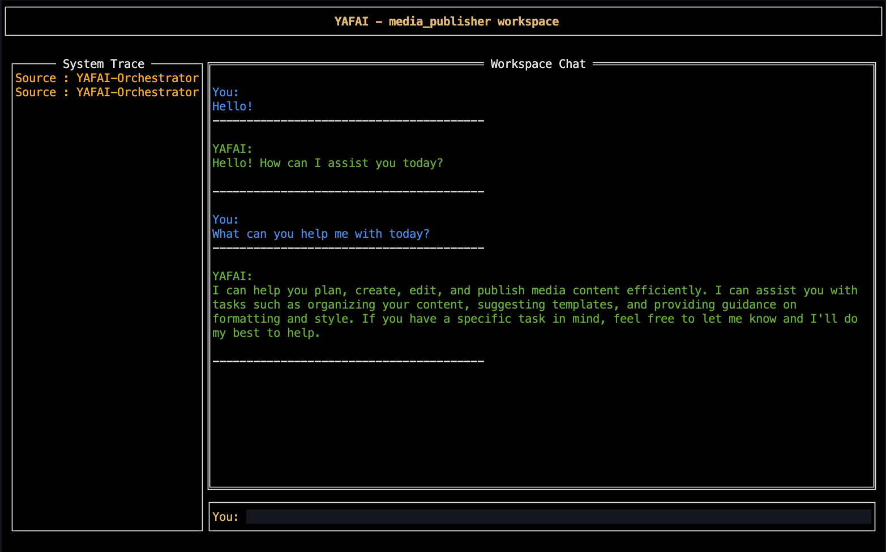

## YAFAI-Yet Another Framework for Agentic Interfaces  🚀

### YAFAI : Define, Deploy and integrate every where mobile,web,desktop or even terminal


### What is YAFAI?

**Yafai** is a lightweight, high-performance multi-agent orchestrator built for power users. It’s designed to be a **drop-in executable** that exposes a fully customizable, config-driven agentic interface — no extra setup, no boilerplate.

Yafai follows an **opinionated orchestration flow**, but gives you **complete control** over what happens within it. Everything is defined through **declarative YAML**, making the system easy to configure, extend, and integrate — all from a single binary.

Read more about the design choice at [Design Doc](design.md).

One binary. Full control. Declarative multi-agent orchestration made simple.

---

# Setup Instructions

## Installation
 ```bash

    brew tap yafai-hub/yafai
    brew install yafai-core

    # when prompted enter the Groq API key.
    # create YAFAI config files and place them under ~/.yafai/configs/ , checkout samples under smaples/recipes.
    # WIP - to allow provider selection and setup through UI.
 ```

## Running YAFAI

### With TerminalUI [ Experimental ]

```bash
    #Terminal UI mode

    yafai-core -m tui 

    # try yafai-core -h for more options.
    # above command runs the link service and starts a TUI process for easy use.
    
```




### Run YAFAI Link - No TerminalUI
```bash

    # brew install yafai-core as an executable run it

    yafai-core --mode link 

    # try yafai-core -h for more options.
    # above command exposes the link service and exposes the YAFAI workspace.
    # workspace can be integrated with any client - mobile/meb/desktop or terminal.

```


## Config-Driven Agentic Service Layer

Yafai exposes a config-driven agentic service layer. Pass a configuration file, and it exposes agentic interfaces ready to use. This approach allows for dynamic agent definition and connection, making it easy to adapt to different use cases.

1.  Sample configuration is available at samples/recipes.

    Sample for `config.yaml` structure:

    ```yaml
    # Example configuration
    name: "media_publisher" #workspace_name
    scope: "content_creation" #workspace_creation
    planner: #planner definition
        model: "deepseek-r1-distill-llama-70b"
        provider: "groq"
    orchestrator: # orchestrator definition
        name: "editor_in_chief"
        description: "Oversees content planning, publishing flow, and quality checks."
        scope: "Help user plan, create, edit, and publish media content efficiently."
        model: "llama-3.1-8b-instant"
        provider: "groq"
        goal: "Streamline end-to-end media content publishing."
        team: #team of agents
            content_creator:
                name: "content_creator"
                capabilities: "generate articles, scripts, and media content"
                description: "Creates engaging content for publishing."
                model: "llama-3.2-1b-preview"
                provider: "groq"
                goal: "Produce high-quality media-ready content."
                depends: "editor_in_chief"
                responds: "editor_in_chief"
                status: "Initialised"
            content_editor:
                name: "content_editor"
                capabilities: "edit and enhance generated content"
                description: "Improves clarity, grammar, tone, and formatting."
                model: "llama-3.2-1b-preview"
                provider: "groq"
                goal: "Ensure publication-ready quality."
                depends: "content_creator"
                responds: "editor_in_chief"
                status: "Initialised"
        vector_store: "none"
    ```

---

