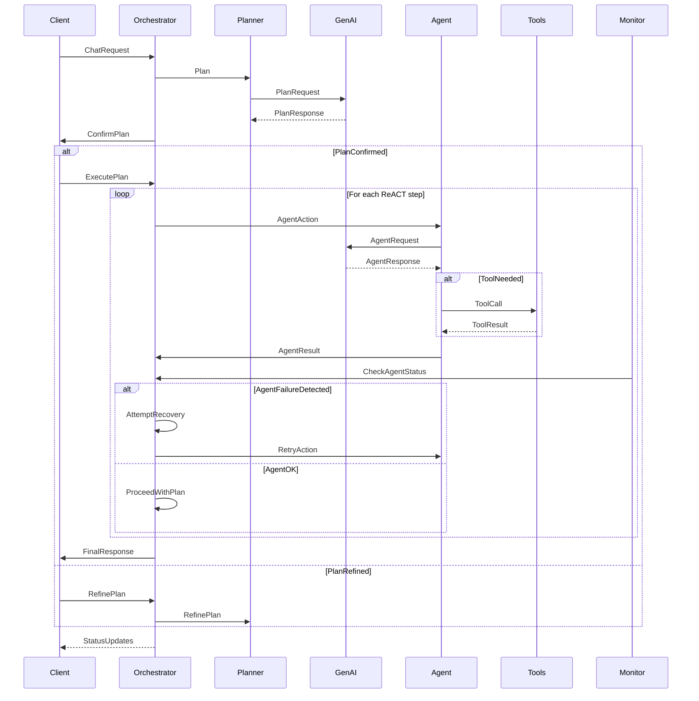

## YAFAI-Yet Another Framework for Agentic Interfaces  🚀
### One binary. Full control. Declarative multi-agent orchestration made simple.

### What is Yafai?

**Yafai** is a lightweight, high-performance multi-agent orchestrator built for power users. It’s designed to be a **drop-in executable** that exposes a fully customizable, config-driven agentic interface — no extra setup, no boilerplate.

Yafai follows an **opinionated orchestration flow**, but gives you **complete control** over what happens within it. Everything is defined through **declarative YAML**, making the system easy to configure, extend, and integrate — all from a single binary.

---

### Config-Driven Agentic Service Layer

Yafai exposes a config-driven agentic service layer. Pass a configuration file, and it exposes agentic interfaces ready to use. This approach allows for dynamic agent definition and connection, making it easy to adapt to different use cases.

### Core Philosophy

- **Explicit Over Implicit** : Configuration should be clear, verbose, and predictable — no magic.

- **Opinionated Flow, Extensible Logic** : The orchestration flow is fixed.What happens inside each step is fully customizable.

- **Config-Driven Architecture**: Agents are defined and connected using declarative YAML. One binary, endless flexibility.

- **Composable and Modular**: Users can inject, replace, or extend agents and flow steps without breaking the system.

- **Transparent by Default**: Built-in tracing ensures every agent's behavior is observable and debuggable.

- **Framework and Ecosystem Friendly**: Supports both core framework contributions and external modules/configs.

- **Minimal Runtime, Maximum Control**: Fast and lightweight.Designed for power users who need full control.

---

### Proposed Sequence diagram for YAFAI 🚀

 

```mermaid
sequenceDiagram
    participant Client
    participant Orchestrator
    participant Planner
    participant GenAI
    participant Agent
    participant Tools
    participant Monitor

    Client->>Orchestrator: ChatRequest
    Orchestrator->>Planner: Plan
    Planner->>GenAI: PlanRequest
    GenAI-->>Planner: PlanResponse
    Orchestrator->>Client: ConfirmPlan
    alt PlanConfirmed
        Client->>Orchestrator: ExecutePlan
        loop For each ReACT step
            Orchestrator->>Agent: AgentAction
            Agent->>GenAI: AgentRequest
            GenAI-->>Agent: AgentResponse
            alt ToolNeeded
                Agent->>Tools: ToolCall
                Tools-->>Agent: ToolResult
            end
            Agent->>Orchestrator: AgentResult
            Monitor->>Orchestrator: CheckAgentStatus
            alt AgentFailureDetected
                Orchestrator->>Orchestrator: AttemptRecovery
                Orchestrator->>Agent: RetryAction
            else AgentOK
                Orchestrator->>Orchestrator: ProceedWithPlan
            end
        end
        Orchestrator->>Client: FinalResponse
    else PlanRefined
        Client->>Orchestrator: RefinePlan
        Orchestrator->>Planner: RefinePlan
    end
    Orchestrator-->>Client: StatusUpdates
```

