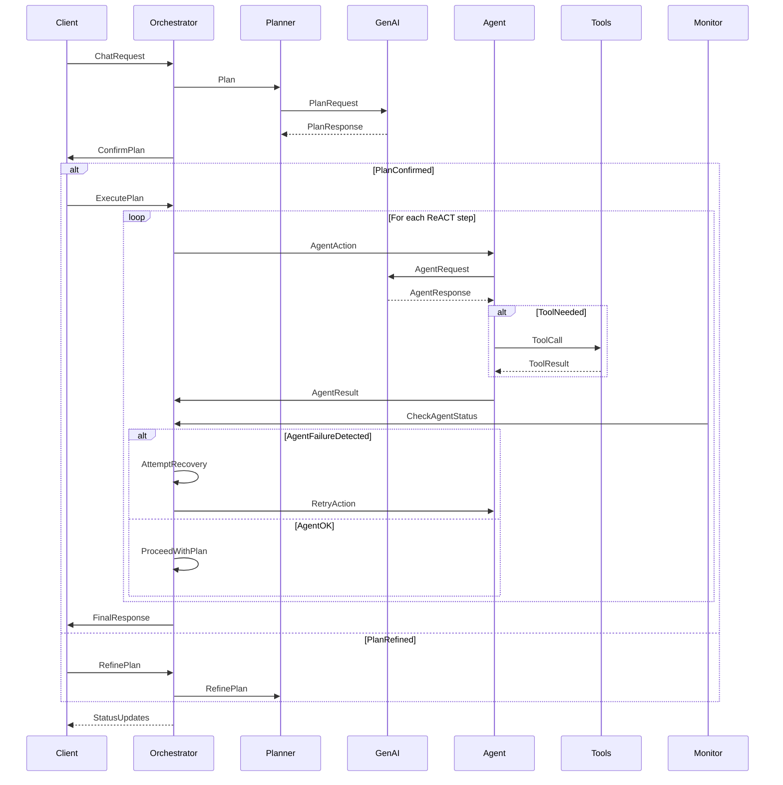

### Proposed Sequence diagram for YAFAI 🚀

 

```mermaid
sequenceDiagram
    participant Client
    participant Orchestrator
    participant Planner
    participant GenAI
    participant Agent
    participant Tools
    participant Monitor

    Client->>Orchestrator: ChatRequest
    Orchestrator->>Planner: Plan
    Planner->>GenAI: PlanRequest
    GenAI-->>Planner: PlanResponse
    Orchestrator->>Client: ConfirmPlan
    alt PlanConfirmed
        Client->>Orchestrator: ExecutePlan
        loop For each ReACT step
            Orchestrator->>Agent: AgentAction
            Agent->>GenAI: AgentRequest
            GenAI-->>Agent: AgentResponse
            alt ToolNeeded
                Agent->>Tools: ToolCall
                Tools-->>Agent: ToolResult
            end
            Agent->>Orchestrator: AgentResult
            Monitor->>Orchestrator: CheckAgentStatus
            alt AgentFailureDetected
                Orchestrator->>Orchestrator: AttemptRecovery
                Orchestrator->>Agent: RetryAction
            else AgentOK
                Orchestrator->>Orchestrator: ProceedWithPlan
            end
        end
        Orchestrator->>Client: FinalResponse
    else PlanRefined
        Client->>Orchestrator: RefinePlan
        Orchestrator->>Planner: RefinePlan
    end
    Orchestrator-->>Client: StatusUpdates
```

