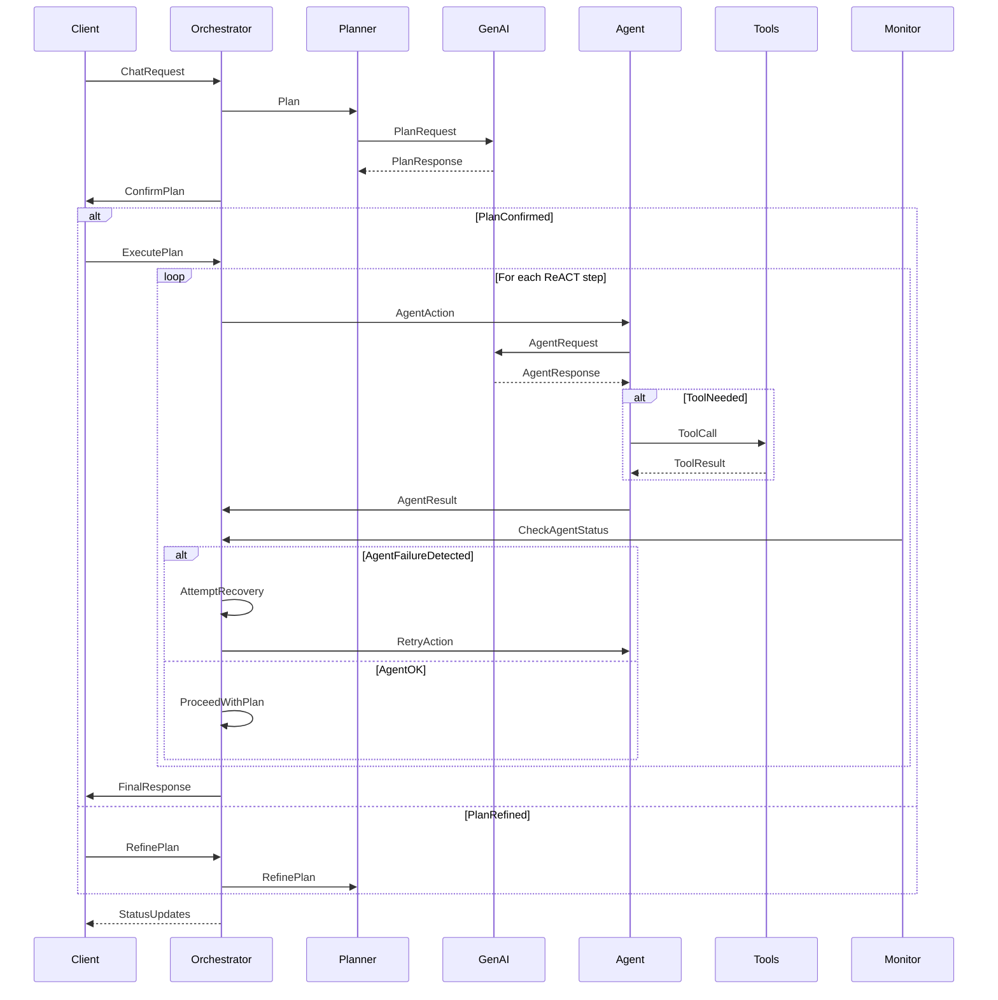

### Core Philosophy

- **Explicit Over Implicit** : Configuration should be clear, verbose, and predictable — no magic.

- **Opinionated Flow, Extensible Logic** : The orchestration flow is fixed.What happens inside each step is fully customizable.

- **Config-Driven Architecture**: Agents are defined and connected using declarative YAML. One binary, endless flexibility.

- **Composable and Modular**: Users can inject, replace, or extend agents and flow steps without breaking the system.

- **Transparent by Default**: Built-in tracing ensures every agent's behavior is observable and debuggable.

- **Framework and Ecosystem Friendly**: Supports both core framework contributions and external modules/configs.

- **Minimal Runtime, Maximum Control**: Fast and lightweight.Designed for power users who need full control.

---

### Proposed Sequence diagram for YAFAI 🚀

 

